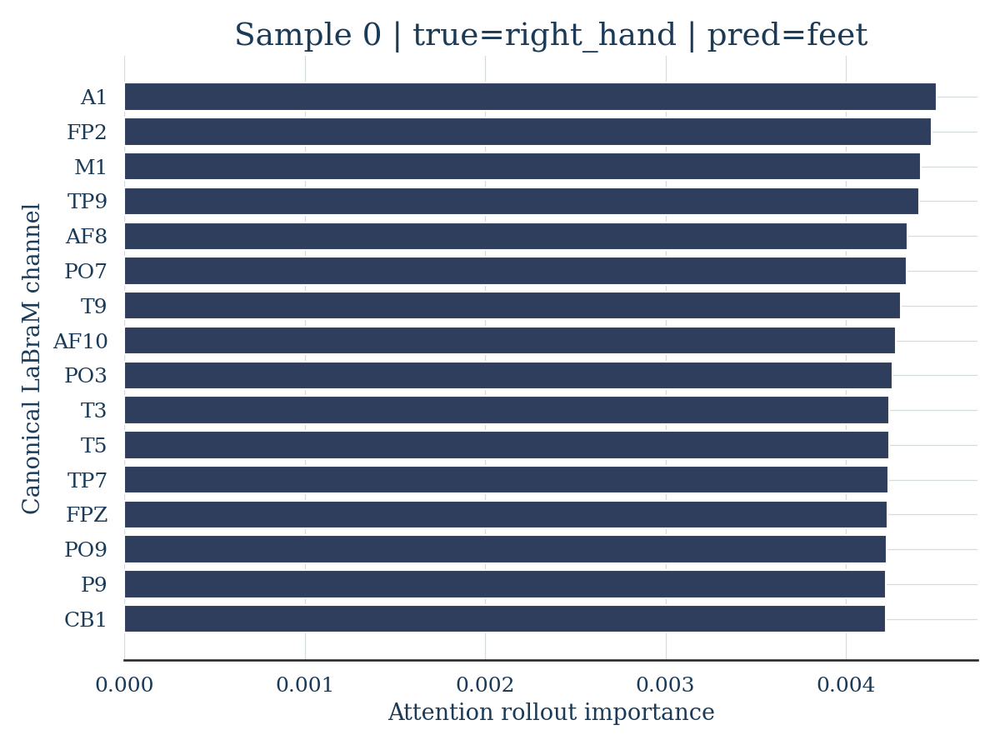
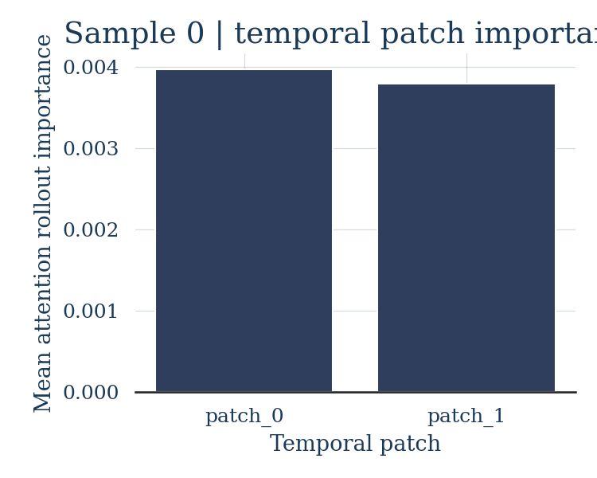
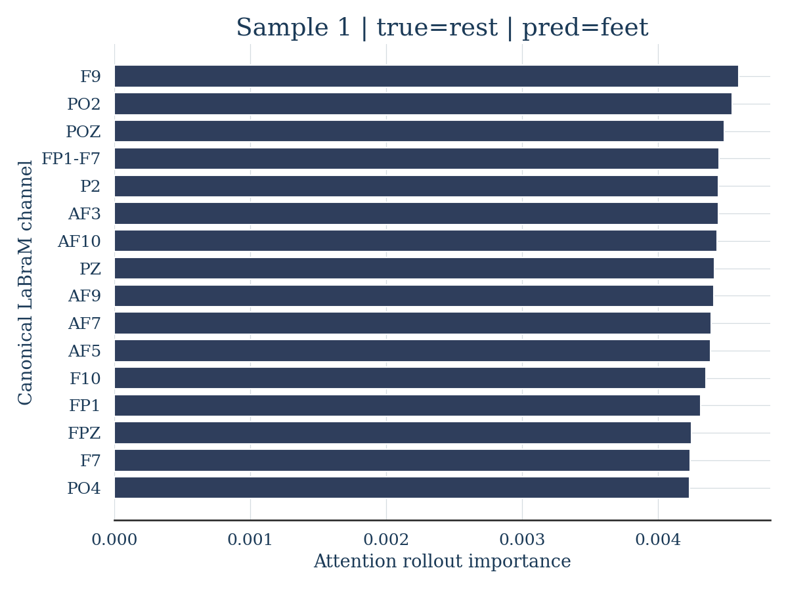
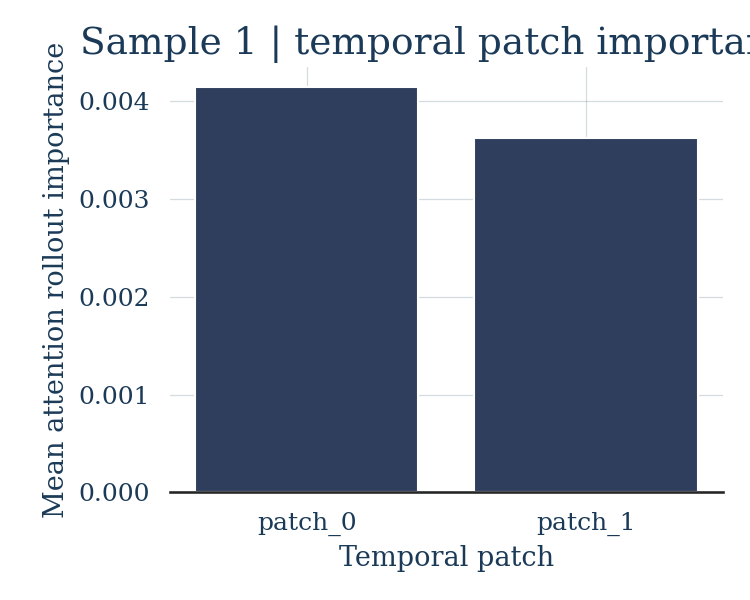
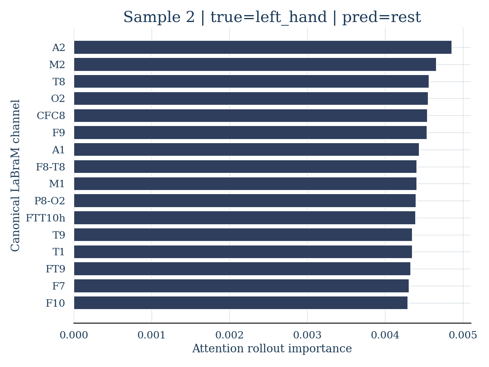
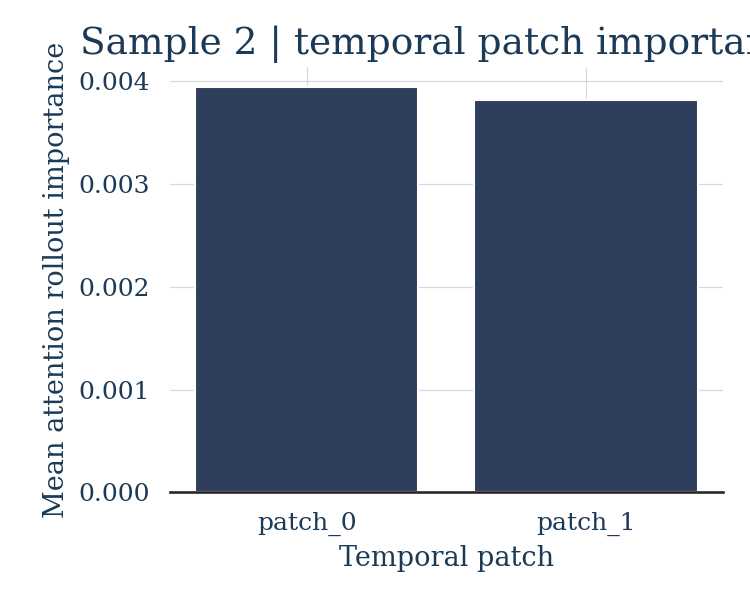
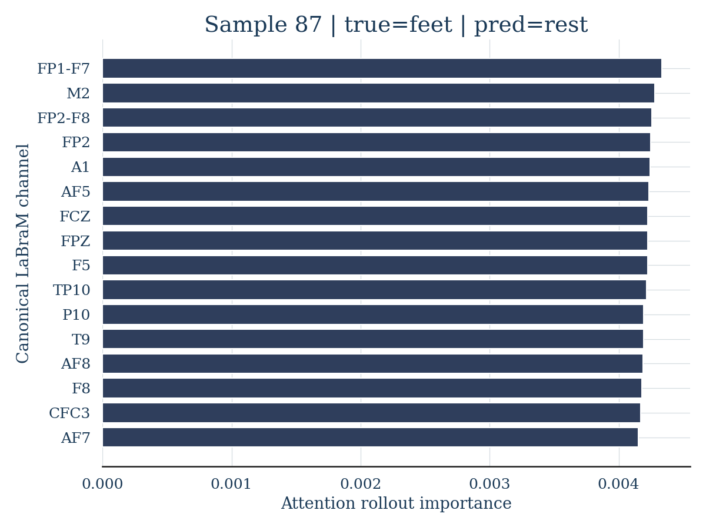
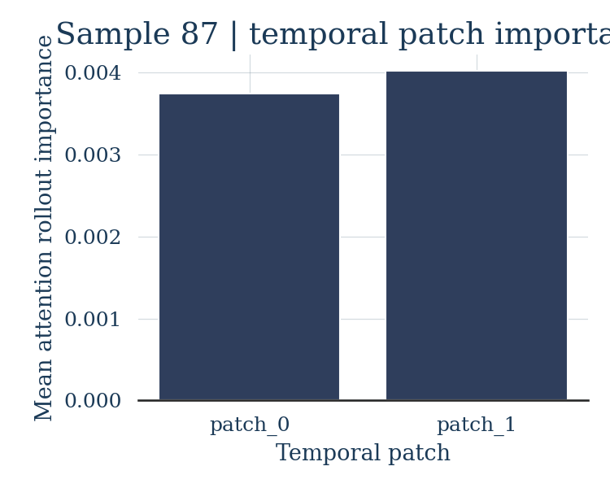

# Phase 3 — Attention Rollout Explainability

## Method

Attention rollout was computed across all 12 LaBraM transformer blocks.

For each transformer block:

- attention heads were averaged
- an identity residual connection was added
- attention rows were normalized
- rollout matrices were multiplied across layers

The CLS-token rollout was summarized into:

- 256 patch-token importance scores
- 128 canonical LaBraM channel importance scores
- 2 temporal patch importance scores

This phase is designed as a transformer-attention inspection module for the LaBraM-based Motor Imagery pipeline. It should be interpreted as an engineering explainability layer, not as a clinically validated EEG physiology explanation.

## Output Artifacts

The raw Kaggle output was saved as:

```text
/kaggle/working/attention_rollout_results.npz
```

The generated plot files were saved in Kaggle as:

```text
/kaggle/working/attention_rollout_plots/
```

The following visualization files are committed to GitHub:

```text
results/figures/phase3_attention_rollout/sample_0_top_channels.png
results/figures/phase3_attention_rollout/sample_0_time_patches.png
results/figures/phase3_attention_rollout/sample_1_top_channels.png
results/figures/phase3_attention_rollout/sample_1_time_patches.png
results/figures/phase3_attention_rollout/sample_2_top_channels.png
results/figures/phase3_attention_rollout/sample_2_time_patches.png
results/figures/phase3_attention_rollout/sample_3_top_channels.png
results/figures/phase3_attention_rollout/sample_3_time_patches.png
```

The binary `.npz` file is not committed to GitHub. The repository stores reproducible code, summarized results, and selected visualization figures.

## Samples

### Sample 0 — dataset index 0

- True label: `right_hand`
- Predicted label: `feet`

Top canonical LaBraM channels:

| Rank | Channel | Importance |
|---:|---|---:|
| 1 | A1 | 0.004505 |
| 2 | FP2 | 0.004474 |
| 3 | M1 | 0.004416 |
| 4 | TP9 | 0.004409 |
| 5 | AF8 | 0.004340 |
| 6 | PO7 | 0.004337 |
| 7 | T9 | 0.004304 |
| 8 | AF10 | 0.004278 |
| 9 | PO3 | 0.004261 |
| 10 | T3 | 0.004240 |
| 11 | T5 | 0.004240 |
| 12 | TP7 | 0.004235 |
| 13 | FPZ | 0.004232 |
| 14 | PO9 | 0.004228 |
| 15 | P9 | 0.004224 |
| 16 | CB1 | 0.004223 |

Temporal patch importance:

| Patch | Importance |
|---:|---:|
| 0 | 0.003973 |
| 1 | 0.003792 |

#### Sample 0 figures





### Sample 1 — dataset index 1

- True label: `rest`
- Predicted label: `feet`

Top canonical LaBraM channels:

| Rank | Channel | Importance |
|---:|---|---:|
| 1 | F9 | 0.004596 |
| 2 | PO2 | 0.004547 |
| 3 | POZ | 0.004487 |
| 4 | FP1-F7 | 0.004449 |
| 5 | P2 | 0.004445 |
| 6 | AF3 | 0.004445 |
| 7 | AF10 | 0.004436 |
| 8 | PZ | 0.004414 |
| 9 | AF9 | 0.004408 |
| 10 | AF7 | 0.004390 |
| 11 | AF5 | 0.004387 |
| 12 | F10 | 0.004350 |
| 13 | FP1 | 0.004315 |
| 14 | FPZ | 0.004247 |
| 15 | F7 | 0.004237 |
| 16 | PO4 | 0.004232 |

Temporal patch importance:

| Patch | Importance |
|---:|---:|
| 0 | 0.004147 |
| 1 | 0.003623 |

#### Sample 1 figures





### Sample 2 — dataset index 2

- True label: `left_hand`
- Predicted label: `rest`

Top canonical LaBraM channels:

| Rank | Channel | Importance |
|---:|---|---:|
| 1 | A2 | 0.004856 |
| 2 | M2 | 0.004659 |
| 3 | T8 | 0.004562 |
| 4 | O2 | 0.004553 |
| 5 | CFC8 | 0.004543 |
| 6 | F9 | 0.004536 |
| 7 | A1 | 0.004438 |
| 8 | F8-T8 | 0.004408 |
| 9 | M1 | 0.004405 |
| 10 | P8-O2 | 0.004395 |
| 11 | FTT10h | 0.004390 |
| 12 | T9 | 0.004351 |
| 13 | T1 | 0.004350 |
| 14 | FT9 | 0.004327 |
| 15 | F7 | 0.004306 |
| 16 | F10 | 0.004293 |

Temporal patch importance:

| Patch | Importance |
|---:|---:|
| 0 | 0.003945 |
| 1 | 0.003817 |

#### Sample 2 figures





### Sample 3 — dataset index 87

- True label: `feet`
- Predicted label: `rest`

Top canonical LaBraM channels:

| Rank | Channel | Importance |
|---:|---|---:|
| 1 | FP1-F7 | 0.004337 |
| 2 | M2 | 0.004278 |
| 3 | FP2-F8 | 0.004257 |
| 4 | FP2 | 0.004248 |
| 5 | A1 | 0.004245 |
| 6 | AF5 | 0.004236 |
| 7 | FCZ | 0.004225 |
| 8 | FPZ | 0.004224 |
| 9 | F5 | 0.004223 |
| 10 | TP10 | 0.004217 |
| 11 | P10 | 0.004192 |
| 12 | T9 | 0.004192 |
| 13 | AF8 | 0.004188 |
| 14 | F8 | 0.004179 |
| 15 | CFC3 | 0.004171 |
| 16 | AF7 | 0.004153 |

Temporal patch importance:

| Patch | Importance |
|---:|---:|
| 0 | 0.003741 |
| 1 | 0.004024 |

#### Sample 3 figures





## Interpretation

The model predictions remain weak, consistent with the Phase 1 baseline. However, Phase 3 successfully demonstrates that attention rollout can be extracted from the adapted LaBraM transformer and summarized at multiple levels:

- token-level importance
- canonical channel-level importance
- temporal-patch-level importance

The visualized top-channel and temporal-patch plots make the explanation outputs easier to inspect in the GitHub report.

Across all four samples, top attention channels are predominantly frontal and temporal (AF9, FP1, AF8, FPZ, A1, M2, T8), with central channels (C3, Cz, C4) absent from the top-ranked positions. This is physiologically unexpected for motor imagery, where contralateral sensorimotor cortex activity (C3/C4) is the canonical signal. The absence of central-channel dominance is consistent with the weak Phase 1 baseline (macro-F1 ~0.22) and suggests the head-only fine-tuned model has not yet learned a motor-specific representation in the transformer's attention structure.


## Scope Note

This phase uses attention rollout only. SHAP, LIME, and perturbation-based explainers are intentionally out of scope.

Attention rollout should be treated as a model-inspection method, not as a clinically validated neurophysiological explanation.
