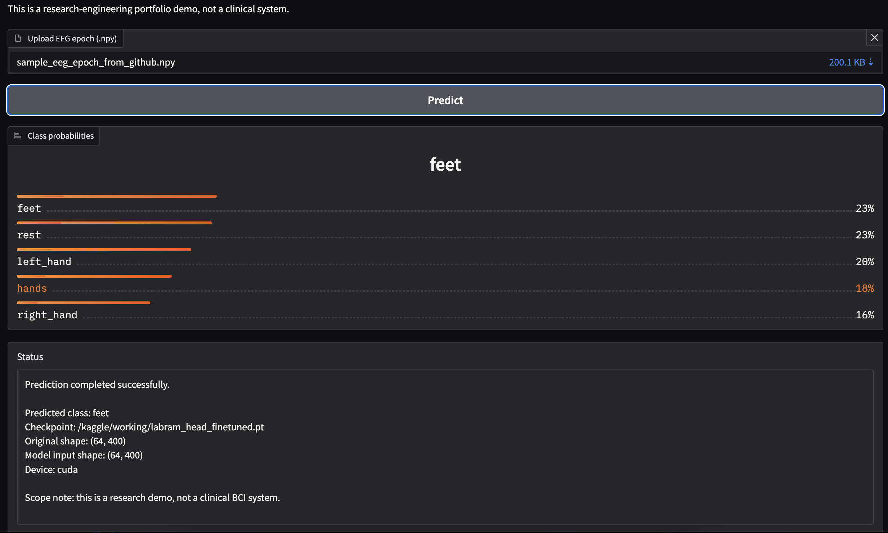

# Phase 4 — Lightweight Gradio Demo

## Goal

Phase 4 adds a lightweight Gradio interface for the LaBraM Motor Imagery BCI pipeline.

The demo accepts one EEG epoch as a `.npy` file and returns:

- predicted motor imagery class
- class probabilities
- input-shape validation details
- checkpoint/device information

This is a research-engineering portfolio demo, not a clinical BCI system.

## Implementation

Main application file:

```text
app.py
```

The demo supports the following input shapes:

```text
(64, 400)
(1, 64, 400)
(400, 64)  # automatically transposed
```

The model is loaded from the Phase 1 head-only checkpoint.

Checkpoint search order:

```text
LABRAM_CHECKPOINT environment variable
/kaggle/working/labram_head_finetuned.pt
checkpoints/labram_head_finetuned.pt
labram_head_finetuned.pt
```

The app caches the loaded model so repeated predictions do not reload the checkpoint.

## Tested Environment

The demo was tested on Kaggle using GPU acceleration.

```text
Device: cuda
Checkpoint: /kaggle/working/labram_head_finetuned.pt
```

The GitHub version was tested from a fresh clone:

```text
git clone https://github.com/mohamad679/labram-mi-project.git
pip install -r requirements.txt
python -m py_compile app.py
```

The syntax check passed successfully.

## Backend Prediction Test

A representative EEG test epoch was saved as:

```text
/kaggle/working/sample_eeg_epoch_from_github.npy
```

Input metadata:

```text
sample index : 0
sample shape : (64, 400)
true label   : right_hand
```

Prediction output:

| Class | Probability |
|---|---:|
| feet | 0.2333 |
| hands | 0.1807 |
| left_hand | 0.2032 |
| rest | 0.2274 |
| right_hand | 0.1554 |

Predicted class:

```text
feet
```

The result is consistent with the weak Phase 1 baseline and should not be interpreted as a clinically meaningful prediction.

## Gradio UI Test

The Gradio interface launched successfully on Kaggle and produced a temporary public Gradio URL during the session.

A `.npy` sample was uploaded through the UI, and the app returned the same probability distribution and predicted class as the backend test.

Observed UI output:

```text
Predicted class: feet
Original shape: (64, 400)
Model input shape: (64, 400)
Device: cuda
```

The probability ranking displayed in the UI was:

```text
feet       ~23%
rest       ~23%
left_hand  ~20%
hands      ~18%
right_hand ~16%
```

## UI Screenshot

The following screenshot is committed to GitHub:

```text
results/figures/phase4_gradio_demo/gradio_ui_prediction.png
```



## Scope Note

The current demo is an interactive proof-of-functionality for model loading, input validation, inference, and probability display.

It is not a production BCI interface and does not provide clinical guidance.

## Current Status

Phase 4 Gradio demo implementation and Kaggle UI test are complete.

HuggingFace Spaces deployment remains the next packaging step if a persistent public demo is required.
